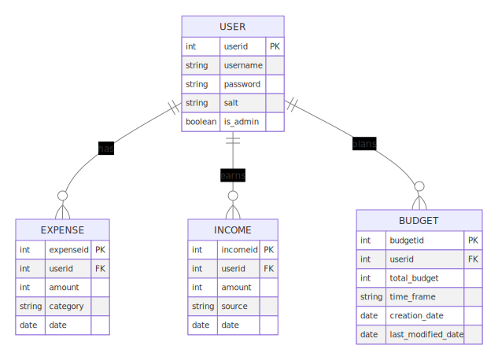

# FinleyJepson_T2A2

T2A2 API WebServer

## Links

- [Trello](https://trello.com/b/lCRtPg9I/finleyjepsont2a2)
- [GitHub](https://github.com/finleyjepson/FinleyJepson_T2A2)

## Installation

In a terminal, run the following commands:

1. open src folder in terminal `cd FinleyJepson_T2A2/src` or `cd src` if already in FinleyJepson_T2A2 folder
2. `python3 -m venv venv`
3. `venv/Scripts/activate` (Windows) or `source venv/bin/activate` (MacOS/Linux)
4. `pip install -r requirements.txt`
5. `flask run` (Ctrl+C to stop the server)
6. `flask init-db`
7. `flask seed-db`

### Testing/Usage

Open Insomnia or Postman and import the `endpoints.json` file to get all endpoints imported.
  or open `http://localhost:5000/` in Insomnia or Postman.

In Insomnia or Postman import the `endpoints.json` file to get the endpoints imported.

## R1 - Identification of the problem

In today's fast-paced world, many individuals face challenges in managing their personal finances effectively. The problem is multifaceted, involving difficulties in tracking daily expenses, understanding spending patterns, and adhering to a budget. This lack of financial oversight often leads to unnecessary overspending and inadequate savings, resulting in financial stress and insecurity. The problem is exacerbated by the absence of user-friendly tools that cater to individual financial management needs. Many existing solutions are either too complex or not personalized, making it challenging for the average person to maintain a clear and continuous overview of their financial health.

## R2 - Why is it a problem that needs solving?

Effective financial management is crucial for achieving long-term financial stability and security. Without a clear understanding of their financial situation, individuals are prone to making poor spending decisions, accumulating debt, and failing to save for future needs. This problem has wider implications, affecting not just individual financial health but also overall well-being and life satisfaction. A solution that simplifies and personalizes financial tracking and budgeting can empower individuals to make informed financial decisions. By providing insights into spending habits and offering tools for budget management, such a solution can foster financial discipline, reduce stress, and promote a more secure financial future.

## R3 - Database system

When considering a database for a Flask API, particularly for applications like financial management, it's crucial to weigh the advantages and disadvantages of popular databases like PostgreSQL and MongoDB.

**PostgreSQL** is renowned for its robustness and reliability, especially in scenarios demanding high data integrity and complex querying capabilities. Its strict adherence to ACID (Atomicity, Consistency, Isolation, Durability) principles ensures that every transaction is processed reliably. This is particularly vital in financial applications where the accuracy and consistency of data are paramount. PostgreSQL also excels in executing complex queries, which are often required for financial data analysis. It offers advanced features such as window functions and common table expressions, which are indispensable for generating detailed financial reports and insights. Moreover, PostgreSQL’s support for a wide range of data types, including structured and semi-structured data (like JSON), makes it a versatile choice for various data requirements.

On the other hand, **MongoDB**, a NoSQL database, is celebrated for its high scalability and flexibility. It stores data in a JSON-like format, which is great for applications that deal with large volumes of unstructured or semi-structured data. MongoDB’s schema-less nature allows for more flexibility in data modeling, which can be beneficial for rapidly evolving applications. However, this flexibility can be a double-edged sword in a finance-based application where data consistency and integrity are crucial. MongoDB's approach to ACID compliance has improved over time, but it still doesn’t match the rigorous standards set by PostgreSQL. Additionally, while MongoDB can handle complex queries, its performance in this regard is typically outmatched by PostgreSQL, especially when dealing with relational data models.

In conclusion, while MongoDB offers scalability and flexibility, for a Flask API designed for financial management, **PostgreSQL** is a more suitable choice. Its superior transactional integrity, advanced querying capabilities, and robust data integrity features align better with the requirements of financial applications. The ability to handle complex data operations with high accuracy and security makes PostgreSQL the preferred database for scenarios where data consistency and reliable transaction processing are critical.

## R4 - Key functionalities and benefits of an ORM

Object-Relational Mapping (ORM) frameworks are essential in modern software development, linking object-oriented programming with relational databases. They simplify database interactions by allowing developers to use their primary programming language instead of SQL, enhancing code readability and maintainability. This abstraction significantly boosts productivity, as developers can focus on business logic rather than database specifics.

ORMs ensure consistent data handling across applications, maintaining data model integrity. They also offer database agnosticism, allowing seamless switching between different databases, which is vital for scalability and future migrations. Additionally, most ORMs include advanced features like lazy loading and transaction management, further optimizing application performance and reliability.

In essence, ORMs streamline database operations, improving development efficiency and code quality. They provide a vital layer of abstraction that not only simplifies database interactions but also enhances application scalability and maintainability, making them a crucial tool in software development.

## R5 - Endpoints

### `POST /register`

Description: Registers a new user.

Parameters:

- `username` (string): The username of the new user.
- `password` (string): The password for the new user.

Returns:

- A success message if the registration is successful.
- An error message if the username already exists or if the username and password are not provided.

---------------------------------

### `POST /login`

Description: Logs in a user.

Parameters:

- `username` (string): The username of the user.
- `password` (string): The password of the user.

Returns:

- A JWT token and the username if the login is successful.
- An error message if the username and password are not provided or if they are incorrect.

---------------------------------

### `POST /logout`

**This endpoint is protected and requires a valid JWT token.**

Description: Logs out a user.

Parameters: None

Returns: A success message.

---------------------------------

### **`/income`**

**This endpoint is protected and requires a valid JWT token.**

#### `POST`

Description: Adds a new income.

Parameters:

- `amount` (number): The amount of the income.
- `source` (string): The source of the income.

Returns:

- A success message if the operation is successful.
- An error message if the operation fails.

#### `GET`

Description: Retrieves all incomes.

Returns:

- A list of all incomes if the operation is successful.
- An error message if the operation fails.

#### `PUT`

Description: Updates an income.

Parameters:

- `amount` (number): The updated amount of the income.
- `source` (string): The updated source of the income.
- `income_id` (string): The ID of the income to update.

Returns:

- A success message if the operation is successful.
- An error message if the operation fails.

#### `DELETE`

Description: Deletes an income.

Parameters:

- `income_id` (string): The ID of the income to delete.

Returns:

- A success message if the operation is successful.
- An error message if the operation fails.

---------------------------------

### **`/expense`**

**This endpoint is protected and requires a valid JWT token.**

#### `POST`

Description: Adds a new expense.

Parameters:

- `amount` (number): The amount of the expense.
- `category` (string): The category of the expense.

Returns:

- A success message if the operation is successful.
- An error message if the operation fails.

#### `GET`

Description: Retrieves all expenses.

Parameters: 

- `expense_id` (string): The ID of the expense to retrieve. If not provided, all expenses will be retrieved.

Returns:

- A list of all expenses if the operation is successful.
- An error message if the operation fails.

#### `PUT`

Description: Updates an expense.

Parameters:

- `amount` (number): The updated amount of the expense.
- `category` (string): The updated category of the expense.
- `expense_id` (string): The ID of the expense to update.

Returns:

- A success message if the operation is successful.
- An error message if the operation fails.

#### `DELETE`

Description: Deletes an expense.

Parameters:

- `expense_id` (string): The ID of the expense to delete.

Returns:

- A success message if the operation is successful.
- An error message if the operation fails.

---------------------------------

### **`/budget`**

**This endpoint is protected and requires a valid JWT token.**

#### `POST`

Description: Adds a new budget.

Parameters:

- `name` (string): The name of the budget.
- `amount` (number): The amount of the budget.
- `category` (string): The category of the budget.

Returns:

- A success message if the operation is successful.
- An error message if the operation fails.

#### `GET`

**This endpoint is protected and requires a valid JWT token.**

Description: Retrieves all budgets.

Parameters: None

Returns:

- A list of all budgets if the operation is successful.
- An error message if the operation fails.

#### `PUT`

**This endpoint is protected and requires a valid JWT token.**

Description: Updates a budget.

Parameters:

- `name` (string): The updated name of the budget.
- `amount` (number): The updated amount of the budget.
- `category` (string): The updated category of the budget.

Returns:

- A success message if the operation is successful.
- An error message if the operation fails.

#### `DELETE`

**This endpoint is protected and requires a valid JWT token.**

Description: Deletes a budget.

Parameters:

- `budget_id` (string): The ID of the budget to delete.

Returns:

- A success message if the operation is successful.
- An error message if the operation fails.

---------------------------------

### Error Handling for Endpoints

Examples of error handling code:

from `app.py` lines `31-50` :

```python
    # Error handling
    @app.errorhandler(400)
    def bad_request(error):
        return jsonify({'message': 'Bad Request'}), 400

    @app.errorhandler(401)
    def unauthorized(error):
        return jsonify({'message': 'Unauthorized'}), 401

    @app.errorhandler(404)
    def not_found(error):
        return jsonify({'message': 'Not Found'}), 404

    @app.errorhandler(500)
    def internal_server_error(error):
        return jsonify({'message': 'Internal Server Error'}), 500
    
    @app.errorhandler(405)
    def method_not_allowed(error):
        return jsonify({'message': 'Method Not Allowed'}), 405
```

```python
    return jsonify({'message': 'Income deleted successfully'}), 200
else:
    return jsonify({'message': 'Income not found'}), 404
```

^ This error handling code is used to return a message to the user if query returns no results

```python
current_user = get_jwt_identity()
if not current_user:
    return jsonify({'message': 'Unauthorized'}), 401
```

^ This error handling code is used to return a message to the user if no JWT token is provided

```python
if not (user.is_admin):
    jsonify({'message': 'Not authorized to access this resource'}), 401
```

^ This error handling code is used to return a message to the user if the user does not possess is_admin=True

```python
else:
    return jsonify({'message': 'Invalid username or password'}), 401
```

^ This error handling code is used to return a message to the user if the username or password is incorrect

```python
# Check that username and password are provided
if not username or not password:
    return jsonify({'message': 'Username and password are required'}), 400
```

^ This error handling code is used to return a message to the user if the username or password is not provided

```python
if existing_user:
    return jsonify({'message': 'Username already exists'}), 400
```

^ This error handling code is used to return a message to the user if the username already exists

## R6 - ERD
The Entity-Relationship Diagram (ERD) represents the database schema for the Flask server application that manages users, expenses, incomes, and budgets.

1. **USER Model:**
   - **Table Name:** `USER`
   - **Attributes:**
     - `userid`: Primary Key (PK), Integer. Uniquely identifies each user.
     - `username`: String(35). Stores the username of the user.
     - `password`: String(255). Stores the encrypted password.
     - `salt`: String(255). Used for password hashing.
     - `is_admin`: Boolean. Indicates whether the user has administrative privileges.
   - **Associations:**
     - One-to-Many with `Expense`: A user can have multiple expenses.
     - One-to-Many with `Income`: A user can have multiple income records.
     - One-to-Many with `Budget`: A user can create multiple budgets.

2. **Expense Model:**
   - **Table Name:** `expense`
   - **Attributes:**
     - `expenseid`: PK, Integer. Uniquely identifies each expense.
     - `userid`: Foreign Key (FK), Integer. Links to the `USER` table.
     - `amount`: Integer. The amount of the expense.
     - `category`: String(255). The category of the expense.
     - `date`: DATE. The date of the expense.
   - **Association:**
     - Many-to-One with `USER`: Each expense is associated with a specific user.

3. **Income Model:**
   - **Table Name:** `income`
   - **Attributes:**
     - `incomeid`: PK, Integer. Uniquely identifies each income record.
     - `userid`: FK, Integer. Links to the `USER` table.
     - `amount`: Integer. The amount of income.
     - `source`: String(255). The source of the income.
     - `date`: DATE. The date of the income record.
   - **Association:**
     - Many-to-One with `USER`: Each income record is associated with a specific user.

4. **Budget Model:**
   - **Table Name:** `budgets`
   - **Attributes:**
     - `budgetid`: PK, Integer. Uniquely identifies each budget.
     - `userid`: FK, Integer. Links to the `USER` table.
     - `total_budget`: Integer. The total amount of the budget.
     - `time_frame`: String(50). The time frame of the budget.
     - `creation_date`: DATE. The date when the budget was created.
     - `last_modified_date`: DATE. The date when the budget was last modified.
   - **Association:**
     - Many-to-One with `USER`: Each budget is associated with a specific user.

In the Flask application, these models and associations would be used to manage data related to users, their expenses, incomes, and budgets. The `USER` model acts as the central entity with relationships to the other models, reflecting the user-centric nature of the application. The foreign key relationships ensure data integrity and enable efficient querying and reporting of user-specific financial data.



## R7 - Third party services

### ElephantSQL

- ElephantSQL is a PostgreSQL database-as-a-service provider. It offers a free plan with 20 MB of storage and 20 concurrent connections. It also provides a web-based admin tool for managing databases. ElephantSQL is used to host the PostgreSQL database for this application.

### Flask

- Flask is a Python web framework that provides tools, libraries, and technologies for building web applications. It offers a simple yet powerful API that allows developers to create web applications quickly and efficiently. Flask is used to build the API for this application.

### SQLAlchemy

- SQLAlchemy is a Python SQL toolkit and Object-Relational Mapper (ORM) that provides a comprehensive set of tools for working with databases. It offers a high-level abstraction layer that allows developers to interact with databases using Python instead of SQL. SQLAlchemy is used to implement the database models for this application.

### Psycopg2

- Psycopg2 is a PostgreSQL adapter for Python. It provides a Python DB-API 2.0-compliant interface for developers to interact with PostgreSQL databases. Psycopg2 is used to connect to the PostgreSQL database for this application.

### Flask-JWT-Extended

- Flask-JWT-Extended is a Flask extension that provides JSON Web Token (JWT) support for Flask applications. It offers a simple interface for creating and verifying JWTs, as well as protecting endpoints with JWTs. Flask-JWT-Extended is used to implement user authentication for this application.

### hashlib

- hashlib is a Python library that provides cryptographic hash functions. It offers a wide range of hash algorithms, including MD5, SHA-1, SHA-256, and SHA-512. hashlib is used to hash user passwords for this application.

## R8 - Relationships

The models defined in `models.py` represent tables in a relational database using SQLAlchemy ORM. Here's a brief description of their relationships:

1. `USER`: This model represents a user in the system. It doesn't have a direct relationship with any other model but serves as a foreign key in the `Expense`, `Income`, and `Budget` models. This indicates that each user can have multiple expenses, incomes, and budgets.

```python
class USER(db.Model):
    __tablename__ = 'USER'
    userid = db.Column(db.Integer, primary_key=True)
    username = db.Column(db.String(35), nullable=False)
    password = db.Column(db.String(255), nullable=False)
    salt = db.Column(db.String(255), nullable=False)
    is_admin = db.Column(db.Boolean, nullable=False, default=False)
```

2. `Expense`: This model represents an expense entry. It has a many-to-one relationship with the `USER` model via the `userid` foreign key. This means that each expense is associated with a specific user.

```python
class Expense(db.Model):
    __tablename__ = 'expense'
    expenseid = db.Column(db.Integer, primary_key=True)
    userid = db.Column(db.Integer, db.ForeignKey('USER.userid'), nullable=False)
    amount = db.Column(db.Integer)
    category = db.Column(db.String(255))
    date = db.Column(db.DATE, nullable=False, default=db.func.current_date())
```

3. `Income`: This model represents an income entry. Similar to `Expense`, it also has a many-to-one relationship with the `USER` model via the `userid` foreign key. Each income is associated with a specific user.

```python
class Income(db.Model):
    __tablename__ = 'income'
    incomeid = db.Column(db.Integer, primary_key=True)
    userid = db.Column(db.Integer, db.ForeignKey('USER.userid'), nullable=False)
    amount = db.Column(db.Integer)
    source = db.Column(db.String(255))
    date = db.Column(db.DATE, nullable=False, default=db.func.current_date())
```

4. `Budget`: This model represents a budget entry. It also has a many-to-one relationship with the `USER` model via the `userid` foreign key. Each budget is associated with a specific user.

```python
class Budget(db.Model):
    __tablename__ = 'budgets'
    budgetid = db.Column(db.Integer, primary_key=True)
    userid = db.Column(db.Integer, db.ForeignKey('USER.userid'), nullable=False)
    total_budget = db.Column(db.Integer, nullable=False)
    time_frame = db.Column(db.String(50))
    creation_date = db.Column(db.DATE, nullable=False, default=db.func.current_date())
    last_modified_date = db.Column(db.DATE, nullable=False, default=db.func.current_date())
```

In summary, the `USER` model is related to the `Expense`, `Income`, and `Budget` models in a one-to-many relationship. Each user can have multiple expenses, incomes, and budgets, but each expense, income, and budget entry is associated with exactly one user.

## R9 - Database relations

In this Flask application, A PostgreSQL database is implemented using the SQLAlchemy ORM. The database itself is hosted on ElephantSQL, a PostgreSQL database-as-a-service provider. The database is accessed via the `psycopg2` Python library, which is a PostgreSQL adapter for Python. The database consists of four tables: `USER`, `Expense`, `Income`, and `Budget`. The `USER` table stores user information, including the username and password. The `Expense`, `Income`, and `Budget` tables store expense, income, and budget entries, respectively. Each of these tables has a foreign key referencing the `USER` table, indicating that each expense, income, and budget entry is associated with a specific user.

## R10 - Task Allocation & Tracking
