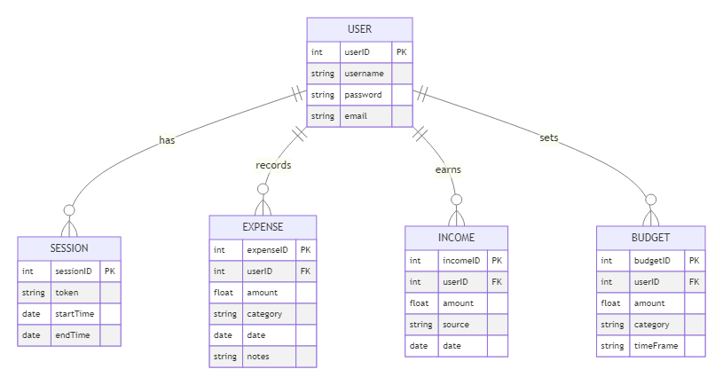

# FinleyJepson_T2A2

 T2A2 API WebServer

## R1 - Identification of the problem

Many individuals struggle with tracking their expenses, creating budgets, and understanding their financial habits.

## R2 - Why is it a problem that needs solving?

A personalized finance management tool can help users gain control over their finances, encouraging better spending habits and financial planning.

## R3 - Database system

## R4 - Key functionalities and benefits of an ORM

## R5 - Endpoints

## R6 - ERD

## R7 - Third party services

## R8 - Relationships

## R9 - Database relations

## R10 - Task Allocation & Tracking
