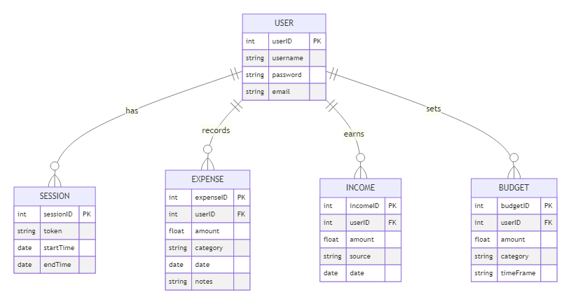

# FinleyJepson_T2A2

T2A2 API WebServer

## Links

- [Trello](https://trello.com/b/lCRtPg9I/finleyjepsont2a2)
- [GitHub](https://github.com/finleyjepson/FinleyJepson_T2A2)

## R1 - Identification of the problem

Many individuals struggle with tracking their expenses, creating budgets, and understanding their financial habits.

## R2 - Why is it a problem that needs solving?

A personalized finance management tool can help users gain control over their finances, encouraging better spending habits and financial planning.

## R3 - Database system

When considering a database for a Flask API, particularly for applications like financial management, it's crucial to weigh the advantages and disadvantages of popular databases like PostgreSQL and MongoDB.

**PostgreSQL** is renowned for its robustness and reliability, especially in scenarios demanding high data integrity and complex querying capabilities. Its strict adherence to ACID (Atomicity, Consistency, Isolation, Durability) principles ensures that every transaction is processed reliably. This is particularly vital in financial applications where the accuracy and consistency of data are paramount. PostgreSQL also excels in executing complex queries, which are often required for financial data analysis. It offers advanced features such as window functions and common table expressions, which are indispensable for generating detailed financial reports and insights. Moreover, PostgreSQL’s support for a wide range of data types, including structured and semi-structured data (like JSON), makes it a versatile choice for various data requirements.

On the other hand, **MongoDB**, a NoSQL database, is celebrated for its high scalability and flexibility. It stores data in a JSON-like format, which is great for applications that deal with large volumes of unstructured or semi-structured data. MongoDB’s schema-less nature allows for more flexibility in data modeling, which can be beneficial for rapidly evolving applications. However, this flexibility can be a double-edged sword in a finance-based application where data consistency and integrity are crucial. MongoDB's approach to ACID compliance has improved over time, but it still doesn’t match the rigorous standards set by PostgreSQL. Additionally, while MongoDB can handle complex queries, its performance in this regard is typically outmatched by PostgreSQL, especially when dealing with relational data models.

In conclusion, while MongoDB offers scalability and flexibility, for a Flask API designed for financial management, **PostgreSQL** is a more suitable choice. Its superior transactional integrity, advanced querying capabilities, and robust data integrity features align better with the requirements of financial applications. The ability to handle complex data operations with high accuracy and security makes PostgreSQL the preferred database for scenarios where data consistency and reliable transaction processing are critical.

## R4 - Key functionalities and benefits of an ORM

Object-Relational Mapping (ORM) frameworks are essential in modern software development, linking object-oriented programming with relational databases. They simplify database interactions by allowing developers to use their primary programming language instead of SQL, enhancing code readability and maintainability. This abstraction significantly boosts productivity, as developers can focus on business logic rather than database specifics.

ORMs ensure consistent data handling across applications, maintaining data model integrity. They also offer database agnosticism, allowing seamless switching between different databases, which is vital for scalability and future migrations. Additionally, most ORMs include advanced features like lazy loading and transaction management, further optimizing application performance and reliability.

In essence, ORMs streamline database operations, improving development efficiency and code quality. They provide a vital layer of abstraction that not only simplifies database interactions but also enhances application scalability and maintainability, making them a crucial tool in software development.

## R5 - Endpoints

### `POST /register`

Description: Registers a new user.

Parameters:

- `username` (string): The username of the new user.
- `password` (string): The password for the new user.

Returns:

- A success message if the registration is successful.
- An error message if the username already exists or if the username and password are not provided.

### `POST /login`

Description: Logs in a user.

Parameters:

- `username` (string): The username of the user.
- `password` (string): The password of the user.

Returns:

- A JWT token and the username if the login is successful.
- An error message if the username and password are not provided or if they are incorrect.

### `POST /logout`

Description: Logs out a user.

Parameters: None

Returns: A success message.

### `POST /income`, `GET /income`, `PUT /income`, `DELETE /income`

Description: Manages user incomes. Depending on the method, it can add a new income, retrieve all incomes, update an income, or delete an income.

Parameters:

- `amount` (number): The amount of the income.
- `source` (string): The source of the income.
- `income_id` (string): The ID of the income to update or delete.

Returns:

- A success message if the operation is successful.
- An error message if the operation fails.

### `POST /budget`, `GET /budget`, `PUT /budget`, `DELETE /budget`

Description: Manages user budgets. Depending on the method, it can add a new budget, retrieve all budgets, update a budget, or delete a budget.

Parameters:

- `name` (string): The name of the budget.
- `amount` (number): The amount of the budget.
- `category` (string): The category of the budget.

Returns:

- A success message if the operation is successful.
- An error message if the operation fails.

### `POST /expense`, `GET /expense`, `PUT /expense`, `DELETE /expense`

Description: Manages user expenses. Depending on the method, it can add a new expense, retrieve all expenses, update an expense, or delete an expense.

Parameters:

- `amount` (number): The amount of the expense.
- `category` (string): The category of the expense.
- `expense_id` (string): The ID of the expense to update or delete.

Returns:

- A success message if the operation is successful.
- An error message if the operation fails.

## R6 - ERD

## R7 - Third party services

## R8 - Relationships

## R9 - Database relations

## R10 - Task Allocation & Tracking
